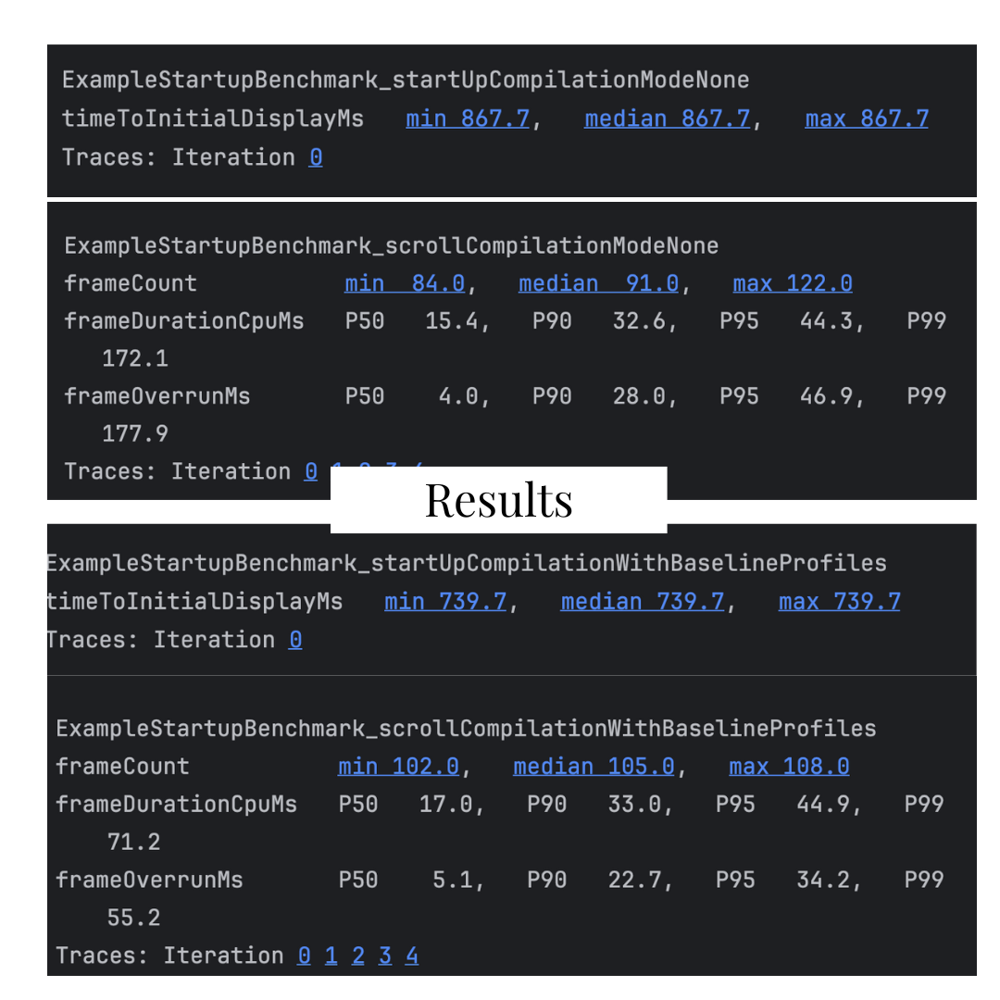

# Compose Baseline Profile + Macrobenchmark (Startup & Jank)

[](#)

[](#)

[](#)

[](LICENSE)

**Measure → Optimize → Re-measure.**
This project demonstrates how to speed up an Android Compose app using **Baseline Profiles** and verify wins with **Macrobenchmark** (cold start & scroll jank). It includes robust UI Automator flows, Perfetto traces, and scripts/CI you can reuse in real apps.

---

## ✨ Highlights

* **Cold start improved ~15%** after applying Baseline Profiles
  (median *timeToInitialDisplayMs*: **867.7 ms → 739.7 ms** on device).
* **Reproducible** Gradle tasks for real devices and managed emulators.
* **Robust UIAutomator** helpers (package-qualified selectors + explicit waits).
* **Android 12+** uses `FrameTimingMetric`; **Android 11** falls back to `JankStatsMetric`.
* Clear, readable **Perfetto** traces and HTML reports.

---

## 📊 Results (sample)

| Scenario                    | Metric                            |  No Profiles | With Baseline Profiles |
| --------------------------- | --------------------------------- | -----------: | ---------------------: |
| **Cold Start**              | `timeToInitialDisplayMs` (median) | **867.7 ms** |         **739.7 ms** ✅ |
| Scroll (fling `LazyColumn`) | `frameDurationCpuMs` (P50)        |      15.4 ms |                17.0 ms |
|                             | `frameOverrunMs` (P50)            |       4.0 ms |                 5.1 ms |

> Interpretation: startup wins are clear (AOT pre-compilation helps the critical path).
> Scroll is similar in this demo; further tuning (layout stability, prefetch, item complexity) can reduce frame time and overruns.

> Add your screenshots under `docs/images/` and link them here if you like.

---

## 🧭 Project tour

```
app/                # Compose demo app (profileable in 'benchmark' buildType)
benchmark/          # Macrobenchmark tests (startup + scroll) and helpers
docs/               # Optional: results write-ups & screenshots
.github/workflows/  # Optional: CI to run macrobench on an emulator and upload reports
scripts/            # Helper scripts for local runs
```

Key files to check:

* `benchmark/src/androidTest/.../ExampleStartupBenchmark.kt` – main tests + helpers.
* `app/src/benchmark/AndroidManifest.xml` – `<profileable android:shell="true"/>`.
* `app/build.gradle[.kts]` – `buildTypes { benchmark { … debuggable false } }`.

---

## 🚀 Quick start

**Requirements**

* Android Studio Koala or newer
* JDK 17
* A device on **Android 12+** (recommended) or use a managed emulator (API 31)

**Install the profileable, non-debuggable app build** (needed for `CompilationMode.Partial()`):

```bash
./gradlew :app:installBenchmark
```

**Run benchmarks on a plugged-in device**:

```bash
./gradlew :benchmark:connectedAndroidTest
```

**Run on a managed emulator (example device name)**:

```bash
./gradlew :benchmark:pixel3XLApi31AndroidTest
```

Reports & traces land here:

```
benchmark/build/reports/androidTests/**                 # HTML
benchmark/build/outputs/connected_android_test_additional_output/**  # Traces
```

---

## 🧪 What the tests do

* **Startup** (`StartupTimingMetric`)

  1. Press Home
  2. `startActivityAndWait()`
  3. Wait for app ready → record *time to initial display*

* **Scroll** (`FrameTimingMetric` on Android 12+, `JankStatsMetric` on Android 11)

  1. Launch app
  2. Click FAB 10× to add items (`testTag("fab_add_item")`)
  3. Fling list (`testTag("item_list")`) and observe frame timing

> Compose test tags are exposed as resource IDs with
> `Modifier.semantics { testTagsAsResourceId = true }` at the root.

---

## 🧩 Code snippets you might reuse

**Expose test tags in Compose**

```kotlin
Surface(
  modifier = Modifier
    .fillMaxSize()
    .semantics { testTagsAsResourceId = true } // makes testTag(...) discoverable by UIAutomator
) { /* NavHost / Scaffold ... */ }
```

**Robust selector + wait helper (Kotlin)**

```kotlin
private const val PKG = "com.shakibaenur.macrobenchmarkstartupoptimizer"

private fun MacrobenchmarkScope.ui(sel: BySelector, t: Long = 5_000): UiObject2 {
    device.wait(Until.hasObject(sel), t)
    return device.findObject(sel) ?: error("UI element not found: $sel")
}

fun MacrobenchmarkScope.addElementsAndScrollDown() {
    val fab = ui(By.res(PKG, "fab_add_item"))
    repeat(10) { fab.click(); device.waitForIdle() }

    val list = ui(By.res(PKG, "item_list"))
    list.setGestureMargin(device.displayWidth / 5)
    list.fling(androidx.test.uiautomator.Direction.DOWN)
}
```

**Android 11 fallback metric**

```kotlin
val metrics = if (Build.VERSION.SDK_INT >= 31)
    listOf(FrameTimingMetric())
else
    listOf(JankStatsMetric()) // requires androidx.metrics:metrics-performance in 'app'
```

---

## ⚙️ CI (optional)

You can run macrobench on a Google API emulator in GitHub Actions and upload the HTML report:

```
.github/workflows/benchmark.yml
```

(Use `reactivecircus/android-emulator-runner` to boot API 31 and invoke your Gradle task.)

---

## 🛠️ Troubleshooting

* **`IllegalArgumentException: 0 found for frameDurationCpuMs`**
  Run on Android **12+** (or keep the JankStats fallback for Android 11).

* **Partial compilation tests fail**
  Ensure the target app build is **non-debuggable** and **profileable**:
  `buildTypes { benchmark { initWith release; signingConfig signingConfigs.debug; debuggable false } }`
  and `app/src/benchmark/AndroidManifest.xml` contains `<profileable android:shell="true"/>`.

* **UI element not found / NPE on `.click()`**
  Use package-qualified selectors (`By.res(PKG, "id")`) and explicit waits.
  Dismiss any first-run OS dialogs (`Allow`, `OK`, `Continue`) in your helper.

---
## 🎥 Demo

<video controls playsinline muted width="720">
  <source src="docs/videos/demo.mp4" type="video/mp4" />
  Your browser doesn’t support the video tag. <a href="docs/videos/demo.mp4">Download the MP4</a>.
</video>

---
## 📊 Screenshots

<p align="center">
  
</p>
---

## 🧭 Roadmap / Next steps

* Reduce `LazyColumn` item complexity to lower `frameDurationCpuMs` and overruns.
* Add BaselineProfile generation test and wire the output `baseline-prof.txt` to `app/src/main/`.
* Compare effects of R8/Proguard rules on startup.
* Automate trace artifact upload in CI releases.

---

## 👤 Author

**Shakiba E Nur** — Software Engineer (Performance & Automation)

* Email: **[shakibaenur2612@gmail.com](mailto:shakibaenur2612@gmail.com)**
* LinkedIn: **[https://www.linkedin.com/in/shakibaenur](https://www.linkedin.com/in/shakibaenur)**
* GitHub: **[https://github.com/Shakibaenur](https://github.com/Shakibaenur)**

If you’re hiring for Android performance excellence (Macrobenchmark, Perfetto, Compose rendering, Baseline Profiles), I’d love to chat.

---

## 📄 License

This repository is licensed under the [MIT License](LICENSE).
